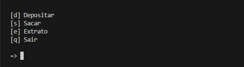
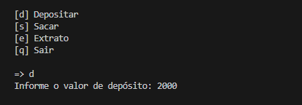
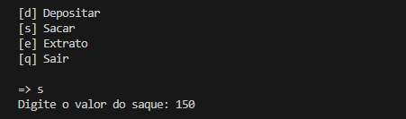
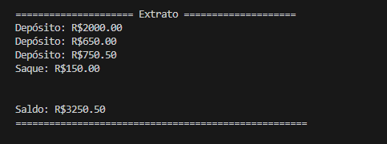
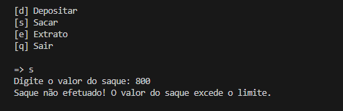
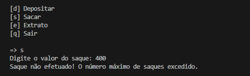

## Criar um sistema bancário com as operações: sacar, depositar e visualizar extrato.


### Requisitos da versão v1 do projeto:

#### Operação depósito:
    - Deve ser possível depositar apenas valores positivos;
    - Todos os depósitos devem ser armazenados em uma variável e exibidos na operação de extrato;
    
#### Operação de saque:
    - O sistema deve permitir realizar 3 saques diários com limite máximo de R$ 500,00 por saque;
    - Caso o usuário não tenha saldo na conta, o sistema deve exibir uma mensagem informando que
    não será possível sacar o dinheiro por falta de saldo;
    - Todos os saques devem ser armazenados em uma variável e exibidos na operação de extrato;
    
#### Operação de extrato:
    - Deve listar todos os depósitos e saques realizados na conta;
    - No fim da listagem deve ser exibido o saldo atual da conta. Se o extrato estiver em branco, 
    exibir a mensagem: Não foram realizadas movimentações.
    - Os valores devem ser exibidos utilizando o formato R$ XXXX.XX

### Como clonar e rodar localmente o projeto

```` bash
# Clone este repositório
git clone https://github.com/cleosilva/primeiro_desafio_python.git
````

### Imagens ilustrativas

#### Executando o projeto:


#### Escolhendo a opção de Depositar


#### Escolhendo a opção de Saque


#### Escolhendo opção de exibir extrato


#### Digitando um valor de saque maior que R$ 500,00


#### Excedendo a quantidade de 3 saques por dia
